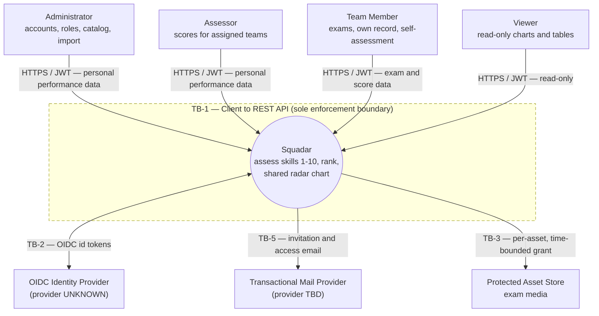
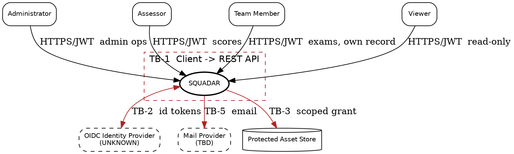
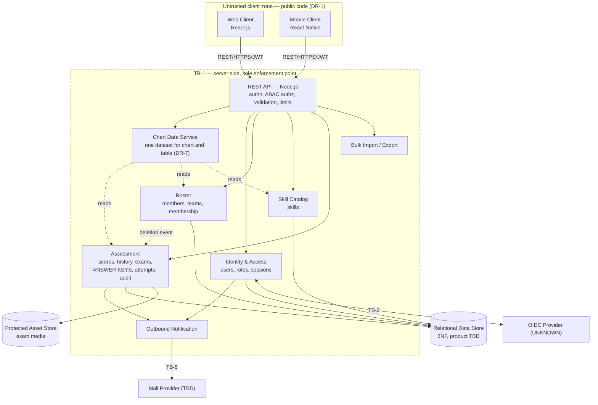
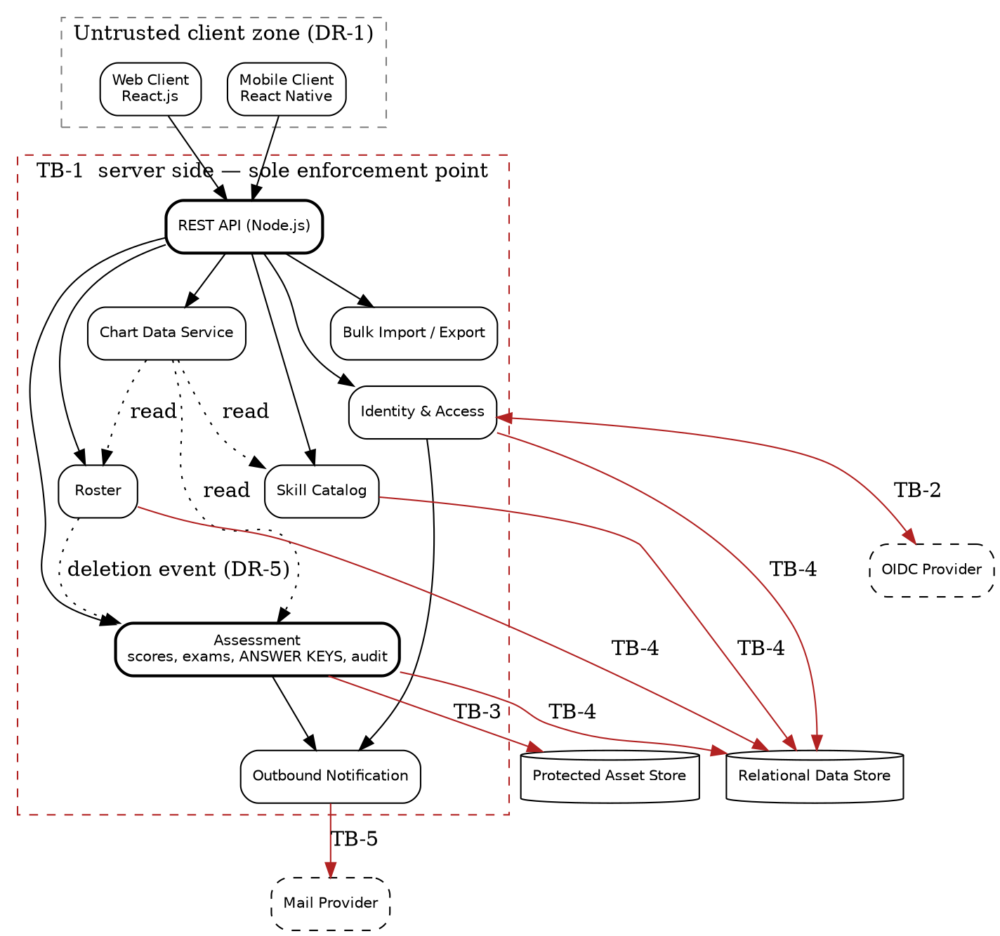
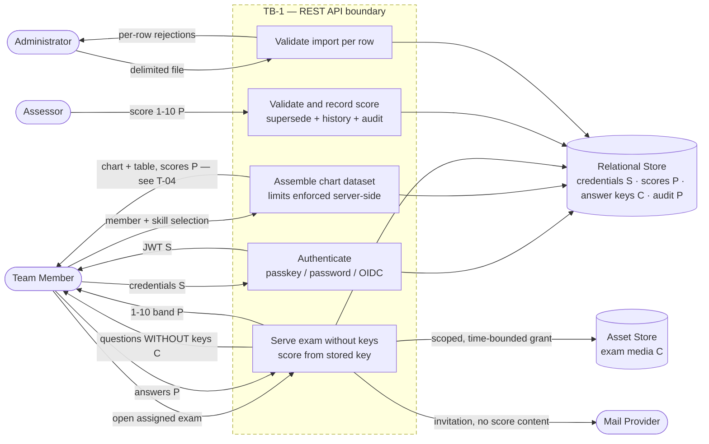
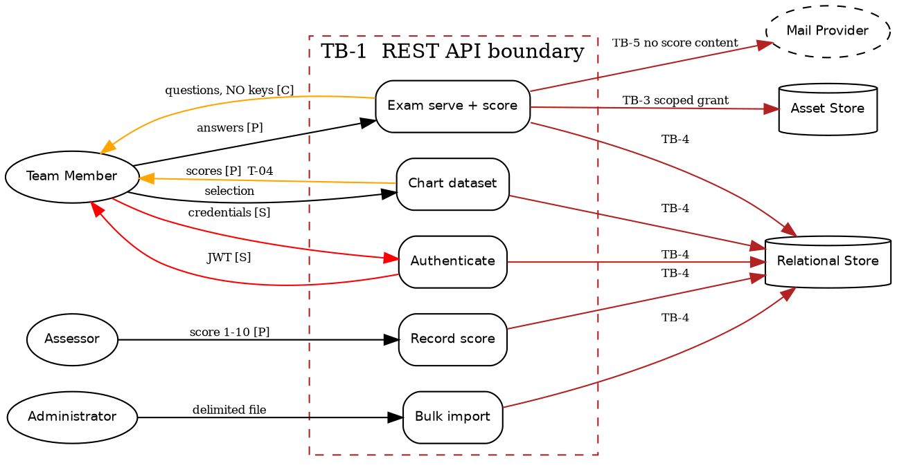
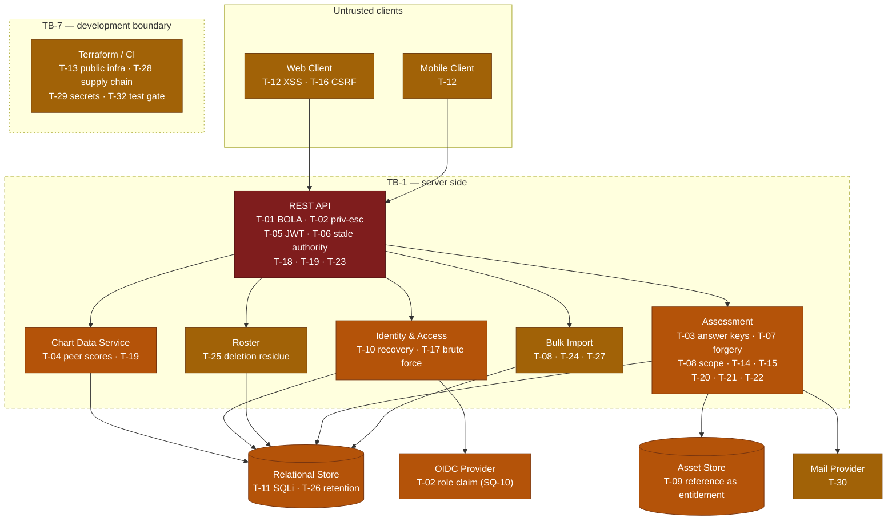
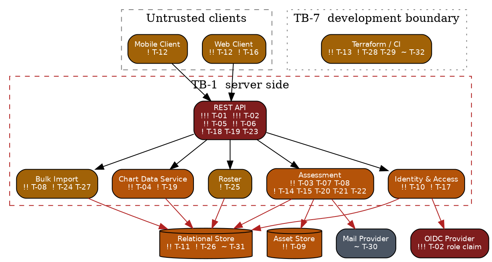
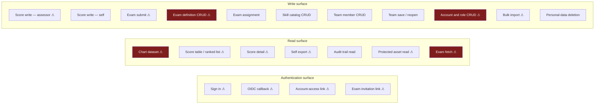
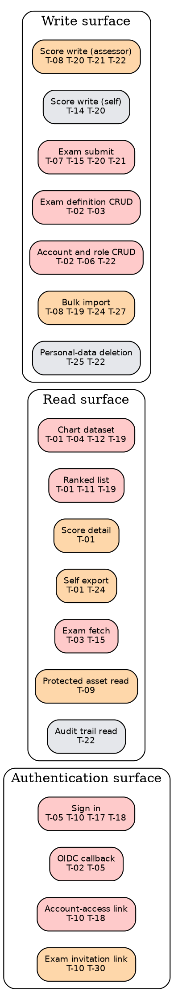

# 08 — Threat Model Diagrams

Generated from `07-consolidated.cdx.json`. Five diagram types, each in ASCII, Mermaid and Graphviz DOT.

**Note on provenance:** `squadar` contains no architecture diagram. Every diagram here is synthesized
from the prose in `ARCHITECTURE.md` and the consolidated model — no component, flow or boundary is
invented. Dashed borders are trust boundaries; solid borders are component groupings.

---

## 1. System Context Diagram

### ASCII

```
                                SQUADAR — SYSTEM CONTEXT
    Legend:  [ ] actor/system   ( ) system under assessment   ==> trust boundary crossing

      +----------------+          +----------------+          +----------------+
      | Administrator  |          |    Assessor    |          |  Team Member   |
      | accounts,roles |          | scores in own  |          | exams, own     |
      | catalog,import |          | assigned teams |          | record, self   |
      +--------+-------+          +--------+-------+          +--------+-------+
               |                           |                           |
               |  HTTPS / JWT              |  HTTPS / JWT              |  HTTPS / JWT
               |  personal perf. data      |  personal perf. data      |  exam + score data
               v                           v                           v
      ===================== TB-1  CLIENT -> REST API  =============================
      |                                                                           |
      |            (            S Q U A D A R                     )               |
      |            (  assess skills 1-10, rank, shared radar chart )               |
      |                                                                           |
      ===========================================================================
               ^                    |                    |                 |
               |  HTTPS / JWT       | TB-2               | TB-5            | TB-3
               |  read-only         | OIDC id tokens     | email           | asset grants
      +--------+-------+   +--------v-------+   +--------v-------+  +------v---------+
      |     Viewer     |   | OIDC Identity  |   | Transactional  |  | Protected      |
      | charts, tables |   |   Provider     |   | Mail Provider  |  | Asset Store    |
      +----------------+   | (UNKNOWN)      |   | (TBD)          |  | exam media     |
                           +----------------+   +----------------+  +----------------+
                             ^ T-02 (SQ-10)       ^ T-10, T-30        ^ T-09

    No unauthenticated product surface exists (FR-1.1). Every edge above crosses a trust boundary.
```

### Mermaid



### Graphviz DOT



---

## 2. Container / Component Diagram

### ASCII

```
                       SQUADAR — COMPONENTS      ( = = = trust boundary,  --- ownership )

  +-- UNTRUSTED CLIENT ZONE ------------------------------------------------------------+
  |  +---------------------------+          +---------------------------+               |
  |  | Web Client   React.js     |          | Mobile Client  React Nat. |               |
  |  | no durable data, DR-1     |          | same surface, same trust  |               |
  |  +-------------+-------------+          +-------------+-------------+               |
  +----------------|----------------------------------------|----------------------------+
                   |                 REST / HTTPS / JWT      |
  === TB-1 ========v========================================v==============================
  |  +----------------------------------------------------------------------------+      |
  |  |  REST API   (Node.js, framework TBD)                                        |      |
  |  |  sole enforcement point: authn, ABAC authz, validation, limits, error shape  |      |
  |  |  +---------------------------------------------------------------------+    |      |
  |  |  |  Chart Data Service  - one dataset for chart AND table (DR-7)        |    |      |
  |  |  +---------------------------------------------------------------------+    |      |
  |  +---+-------------+--------------+---------------+------------------+---------+      |
  |      |             |              |               |                  |                |
  |  +---v-------+ +---v--------+ +---v----------+ +--v-------------+ +--v-------------+  |
  |  | Identity  | |  Roster    | | Skill        | |  Assessment    | | Bulk Import /  |  |
  |  | & Access  | | members,   | | Catalog      | |  scores,history| | Export         |  |
  |  | users,    | | teams,     | | skills       | |  exams, ANSWER | | rows via owner |  |
  |  | roles,    | | membership | |              | |  KEYS, attempts| |                |  |
  |  | sessions  | |            | |              | |  audit entries | |                |  |
  |  +---+-------+ +---+--------+ +---+----------+ +--+-------------+ +--+-------------+  |
  |      |             |              |               |                  |                |
  |      |             +--------------+---------------+------------------+                |
  |      |                            | TB-4                                              |
  |      |                  +---------v----------+      +-------------------------+       |
  |      |                  | Relational Store   |      | Outbound Notification   |       |
  |      |                  | 3NF, product TBD   |      | delivery edge only      |       |
  |      |                  +--------------------+      +-----------+-------------+       |
  ====== |======================================================== | ====== TB-3 ========
         | TB-2                                              TB-5  |        |
  +------v----------+                                   +---------v-----+  +v--------------+
  | OIDC Provider   |                                   | Mail Provider |  | Protected     |
  | (UNKNOWN)       |                                   | (TBD)         |  | Asset Store   |
  +-----------------+                                   +---------------+  +---------------+

  Dependency direction is acyclic: clients -> API -> domain components -> persistence/edges (DR-5).
  No client reaches a store or a domain component directly (DR-2).
```

### Mermaid



### Graphviz DOT



---

## 3. Data Flow Diagram

### ASCII

```
  SQUADAR — DATA FLOW      Sensitivity:  [S] secret  [P] personal performance  [C] confidential system

  ACTOR            TB-1              PROCESSING                    TB-4 / TB-3        STORAGE
  ------------------------------------------------------------------------------------------------
  Team Member  ==> sign in       --> Identity & Access  ========>  credentials [S]    Relational
               [S] credentials       verify passkey/pw/OIDC        session key [S]    Store
                                     issue JWT [S]                                    (enc. at rest
                                     (TB-2 to OIDC provider)                           SPECIFIED,
                                                                                       not built)
  Team Member  ==> select members --> Chart Data Service <========  current scores [P]
               and skills            one dataset -> chart          member records [P]
               <== chart + table      AND table (DR-7)      [P]
                   *** the same payload carries every selected member's scores — see T-04 ***

  Team Member  ==> open exam      --> Assessment          <========  questions [C]
               <== questions       ** answer keys excluded IN Assessment (DR-8) **     answer keys [C]
                   WITHOUT keys [C]                                                    *** never
               ==> answers [P]    --> score server-side from key ==> attempt [P]        outbound ***
               <== 1-10 band [P]      write score + history + audit  score history [P]
                                      in ONE transaction (T-21)      audit entry [P]

  Assessor     ==> score 1-10 [P] --> Assessment: validate range,  ==> supersede current,
                                      authorize team scope (T-08)      retain history [P]

  Administrator==> import file    --> Bulk Import: per-ROW validation and authorization
               <== per-row reject      then write THROUGH Roster / Skill Catalog  ==> members [P]

  Administrator==> delete member  --> Roster --(event)--> Assessment: remove from every
                                      chart, list, export, cache ... and the audit trail? (T-25)

  Any actor    <== exam media     <-- API issues scoped, time-bounded grant == TB-3 ==> media [C]
                                      possession of a reference is NOT entitlement (DR-9)

  System       ==> invitation     == TB-5 ==> Mail Provider   minimum content, never a score (T-30)
```

### Mermaid



### Graphviz DOT



---

## 4. Threat-Annotated Architecture

### ASCII

```
  SQUADAR — THREAT-ANNOTATED ARCHITECTURE
  Severity markers:  !!! Critical   !! High   ! Medium   ~ Low

  +-- UNTRUSTED CLIENTS -------------------------------------------------------------------+
  |  Web Client  !! T-12 stored XSS via chart labels        Mobile Client  ! T-12           |
  |              ! T-16 CSRF (if cookie session)                                            |
  +--------------------------------|--------------------------------------------------------+
  === TB-1 =======================v========================================================
  |  REST API                                                                              |
  |   !!! T-01 object-level authorization on every id-bearing read                         |
  |   !!! T-02 privilege escalation: mass assignment / function-level / OIDC role claim    |
  |    !! T-05 JWT algorithm and claim verification                                        |
  |    !! T-06 stale authority: revocation and role change                                 |
  |     ! T-18 account enumeration    ! T-19 resource exhaustion    ! T-23 logging leaks    |
  |  +----------------------------------------------------------------------------+        |
  |  | Chart Data Service   !! T-04 peer score exposure (FR-1.4 vs FR-7.3)         |        |
  |  |                       ! T-19 cross-product query amplification              |        |
  |  +----------------------------------------------------------------------------+        |
  |  +-------------+ +-----------+ +---------+ +-------------------------+ +--------------+ |
  |  | Identity &  | | Roster    | | Skill   | | Assessment              | | Bulk Import  | |
  |  | Access      | |           | | Catalog | | !! T-03 answer keys     | | !! T-08 out- | |
  |  | !! T-10 rec-| | ! T-25    | |         | | !! T-07 score forgery   | |    of-team   | |
  |  |    overy /  | |   deletion| |         | | !! T-08 assessor scope  | |  ! T-24 CSV  | |
  |  |    links    | |   residue | |         | |  ! T-14 self-inflation  | |  ! T-27 SSRF | |
  |  | ! T-17 brute| |           | |         | |  ! T-15 collusion       | |  ! T-19 size | |
  |  |   force     | |           | |         | |  ! T-20 concurrency     | |              | |
  |  |             | |           | |         | |  ! T-21 partial write   | |              | |
  |  |             | |           | |         | |  ! T-22 audit / admin   | |              | |
  |  +------+------+ +-----+-----+ +----+----+ +-----------+-------------+ +------+-------+ |
  ========= | ============ | =========== | ================= | ================= | =========
       TB-2 |         TB-4 v             v                   | TB-3              | TB-5
  +---------v------+  +----------------------------+  +-------v---------+ +------v---------+
  | OIDC Provider  |  | Relational Store           |  | Asset Store     | | Mail Provider  |
  | !!! T-02 role  |  | !! T-11 SQLi sort/filter   |  | !! T-09 ref as  | | ~ T-30 content |
  |     claim SQ-10|  |  ! T-26 retention undefined|  |    entitlement  | |                |
  +----------------+  |  ~ T-31 fixture data       |  +-----------------+ +----------------+
                      +----------------------------+

  DEVELOPMENT BOUNDARY TB-7 (not a product boundary)
   !! T-13 Terraform provisions a public store    ! T-28 supply chain    ! T-29 secrets/state
   ~ T-32 unenforced test gate, specs as agent instruction channel

  LEGEND  T-01 BOLA | T-02 priv-esc | T-03 answer keys | T-04 peer scores | T-05 JWT | T-06 stale
  authority | T-07 score forgery | T-08 assessor scope | T-09 asset refs | T-10 recovery/links
  T-11 SQLi | T-12 XSS | T-13 public infra | T-14 self-inflation | T-15 collusion | T-16 CSRF
  T-17 brute force | T-18 enumeration | T-19 exhaustion | T-20 concurrency | T-21 partial write
  T-22 audit/admin | T-23 log leakage | T-24 CSV injection | T-25 deletion residue | T-26 retention
  T-27 SSRF | T-28 supply chain | T-29 secrets | T-30 email | T-31 fixtures | T-32 dev boundary
```

### Mermaid



### Graphviz DOT



---

## 5. Attack Surface Map

### ASCII

```
  SQUADAR — ATTACK SURFACE       [*] = carries a Critical or High threat
  Every entry point requires authentication (FR-1.1). There is no unauthenticated product surface.

  ENTRY POINT                    AUTHN        AUTHORIZATION                   THREATS
  ---------------------------------------------------------------------------------------------
 [*] Sign in (passkey/password)  boundary     none (is the boundary)          T-05 T-10 T-17 T-18
 [*] OIDC callback               boundary     issuer/audience/nonce           T-02 T-05
 [*] Account-access email link   link token   single-use, recipient-bound     T-10 T-18
 [*] Exam invitation link        link token   single-use, recipient-bound     T-10 T-30
 [*] Chart dataset               required     role + shared-team membership   T-01 T-04 T-12 T-19
 [*] Score table / ranked list   required     role + team scope               T-01 T-11 T-19
 [*] Score detail read           required     self, or assessor team scope    T-01
 [*] Score write (assessor)      required     Assessor: assigned teams only   T-08 T-20 T-21 T-22
  .  Score write (self)          required     self only                       T-14 T-20
 [*] Exam fetch (questions)      required     assigned attempt; NO keys       T-03 T-15
 [*] Exam submit                 required     assigned, uncompleted attempt   T-07 T-15 T-20 T-21
 [*] Exam definition CRUD        required     Administrator (holds keys)      T-02 T-03
  .  Exam assignment             required     Assessor or Administrator       T-08
  .  Skill catalog CRUD          required     Administrator                   T-12 T-02
  .  Team member CRUD            required     Administrator                   T-02 T-12
  .  Team create / save / reopen required     role-dependent                  T-01 T-25
 [*] Account and role CRUD       required     Administrator only              T-02 T-06 T-22
 [*] Bulk import (file upload)   required     Administrator                   T-08 T-19 T-24 T-27
 [*] Self export                 required     self only                       T-01 T-24
  .  Personal-data deletion      required     Administrator                   T-25 T-22
  .  Audit trail read            required     Administrator only              T-22
 [*] Protected asset read        required     live per-asset grant            T-09
  ---------------------------------------------------------------------------------------------
  22 entry points. 15 carry a Critical or High threat. 0 are unauthenticated by design.

  HIGHEST-VALUE TARGETS
    1. Account and role CRUD  -> Administrator authority -> everything else
    2. Exam fetch / definition -> answer keys -> silent, permanent assessment integrity loss
    3. Chart dataset          -> the whole organization's personal performance data in one payload
```

### Mermaid



### Graphviz DOT



---

## Diagram coverage note

Five diagram types are complete. What is **not** represented, because the consolidated model does not
contain it:

- **Deployment topology** — no cloud provider, network zones, load balancers or subnets exist (`SQ-8`).
- **Sequence diagrams** — no API contract exists to sequence; stage 09 would need one.
- **Physical data model** — no schema exists, so the DFD annotates data *classes*, not tables.
